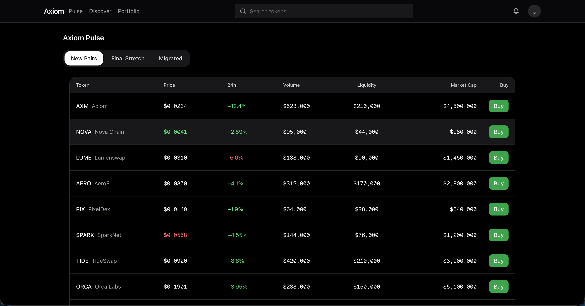
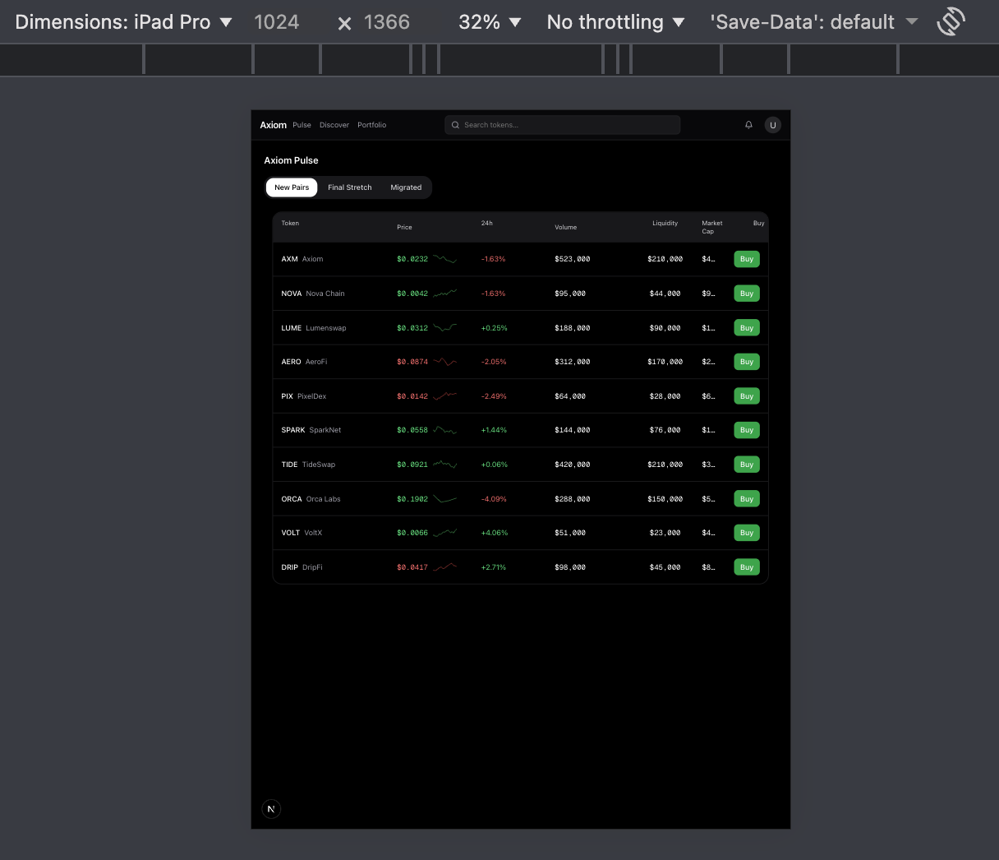
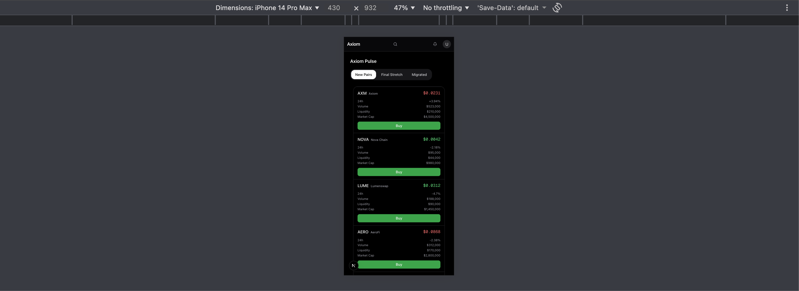

# Axiom – Token Discovery & Trading UI

A **pixel-accurate, high-performance token discovery and trading table** inspired by Axiom Trade.
This project focuses on **real-time UI behavior, responsive design, and production-grade frontend architecture**.

---

## ✨ Features

### 🔍 Token Discovery

* Tabs for **New Pairs**, **Final Stretch**, and **Migrated**
* Dynamic filtering based on token status
* Sorting by **Price**, **24h Volume**, and **Market Cap**

### ⚡ Real-Time Price Updates

* WebSocket-style mocked price feed
* Live updates with:

  * **Directional color persistence** (green ↑ / red ↓)
  * **Text flash animation** on price change
  * **Row-level background flash** on updates

### 📊 Data Visualization

* Inline **sparklines** showing recent price history
* Smooth animations without layout shifts

### 🧩 Rich Interactions

* Tooltip on token symbols
* Popover with detailed token metadata
* Modal dialog for Buy actions
* Hover-based action reveal on desktop

---

## 📱 Responsive Layout (down to 320px)

The application is fully responsive and tested across common breakpoints:

* **Desktop (≥1024px)**
  Full trading table with aligned numeric columns and inline sparklines

* **Tablet (~768px)**
  Condensed table layout with preserved readability

* **Mobile (320px)**
  Card-style stacked rows optimized for small screens, with key metrics prioritized

The layout automatically adapts using Tailwind CSS breakpoints, ensuring:

* No horizontal scrolling
* No layout shifts
* Usable interactions at all sizes

### Screenshots

**Desktop**


**Tablet**


**Mobile (320px)**


---

## 🛠️ Tech Stack

* **Next.js 14 (App Router)**
* **TypeScript (strict mode)**
* **Tailwind CSS**
* **Redux Toolkit** – UI state & sorting logic
* **React Query** – data fetching & caching
* **shadcn/ui (Radix UI)** – Dialogs, Tooltips, Popovers
* **Custom Hooks**

  * `usePriceFlash` – price text animation
  * `useRowFlash` – row-level update feedback

---

## 🧱 Project Architecture

```
src/
├── app/                  # Next.js App Router
├── components/
│   ├── atoms/            # Sparkline, small UI units
│   ├── molecules/        # TokenRow
│   ├── organisms/        # TokenTable, TokenTabs
│   └── ui/               # shadcn/ui components
├── hooks/                # Custom animation hooks
├── lib/                  # Mock data, socket simulation
├── store/                # Redux Toolkit slices
└── types/                # Shared TypeScript types
```

**Design principles**

* Atomic component structure
* Clear separation of concerns
* Reusable and scalable UI patterns

---

## 🚀 Performance & Quality

* No layout shifts during real-time updates
* Grid-based alignment for numeric precision
* Hydration-safe rendering
* Mobile-first responsive strategy
* Designed to score **≥ 90 on Lighthouse (mobile & desktop)**

---

## 🧪 Local Development

```bash
# Install dependencies
npm install

# Start development server
npm run dev
```

Open in browser:
👉 `http://localhost:3000`

---

## 📌 Notes

* Price updates are mocked to simulate WebSocket behavior
* This project focuses on **frontend system design**, not real trading logic
* UI patterns are inspired by professional trading platforms

---

## 📄 License

MIT License

---

## 👤 Author

Built as a frontend engineering showcase demonstrating:

* Real-time UI patterns
* Responsive system design
* State management at scale
* Production-ready React architecture
